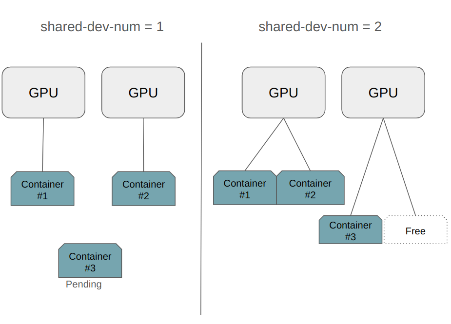

# Intel GPU device plugin for Kubernetes

Table of Contents

* [Introduction](#introduction)
* [Modes and Configuration Options](#modes-and-configuration-options)
* [Operation modes for different workload types](#operation-modes-for-different-workload-types)
* [Installing driver and firmware for Intel GPUs](#installing-driver-and-firmware-for-intel-gpus)
* [Pre-built Images](#pre-built-images)
* [Installation](#installation)
    * [Install with NFD](#install-with-nfd)
    * [Install with Operator](#install-with-operator)
    * [Verify Plugin Registration](#verify-plugin-registration)
* [Testing and Demos](#testing-and-demos)
* [Notes](#notes)
  * [Running GPU plugin as non-root](#running-gpu-plugin-as-non-root)
  * [Labels created by GPU plugin](#labels-created-by-gpu-plugin)
  * [SR-IOV use with the plugin](#sr-iov-use-with-the-plugin)
  * [CDI support](#cdi-support)
  * [KMD and UMD](#kmd-and-umd)
  * [Health management](#health-management)
  * [by-path mounting](#by-path-mounting)
  * [Issues with media workloads on multi-GPU setups](#issues-with-media-workloads-on-multi-gpu-setups)
    * [Workaround for QSV and VA-API](#workaround-for-qsv-and-va-api)

## Introduction

Intel GPU plugin facilitates Kubernetes workload offloading by providing access to
discrete (including Intel® Data Center GPU Flex & Max Series) and integrated Intel GPU devices
supported by the host kernel.

Use cases include, but are not limited to:
- Media transcode
- Media analytics
- Cloud gaming
- High performance computing
- AI training and inference

For example containers with Intel media driver (and components using that), can offload
video transcoding operations, and containers with the Intel OpenCL / oneAPI Level Zero
backend libraries can offload compute operations to GPU.

Intel GPU plugin may register four per-node resource types to the Kubernetes cluster:
| Resource | Description |
|:---- |:-------- |
| gpu.intel.com/i915 | Legacy `i915` KMD (Kernel Mode Driver) provided GPU instance |
| gpu.intel.com/i915_monitoring | Monitoring resource for the `i915` KMD provided devices |
| gpu.intel.com/xe | `xe` KMD provided GPU instance |
| gpu.intel.com/xe_monitoring | Monitoring resource for the `xe` KMD provided devices |

For workloads on different KMDs, see [KMD and UMD](#kmd-and-umd).

## Modes and Configuration Options

| Flag | Argument | Default | Meaning |
|:---- |:-------- |:------- |:------- |
| -enable-monitoring | - | disabled | Enable '*_monitoring' resource that provides access to all Intel GPU devices on the node, [see use](./monitoring.md) |
| -health-management | - | disabled | Enable health management by requesting data from oneAPI/Level-Zero interface. Requires [GPU Level-Zero](../gpu_levelzero/) sidecar. See [health management](#health-management) |
| -wsl | - | disabled | Adapt plugin to run in the WSL environment. Requires [GPU Level-Zero](../gpu_levelzero/) sidecar. |
| -shared-dev-num | int | 1 | Number of containers that can share the same GPU device |
| -allow-ids | string | "" | A list of PCI Device IDs that are allowed to be registered as resources. Default is empty (=all registered). Cannot be used together with `deny-ids`. |
| -deny-ids | string | "" | A list of PCI Device IDs that are denied to be registered as resources. Default is empty (=all registered). Cannot be used together with `allow-ids`. |
| -allocation-policy | string | none | 3 possible values: balanced, packed, none. For shared-dev-num > 1: _balanced_ mode spreads workloads among GPU devices, _packed_ mode fills one GPU fully before moving to next, and _none_ selects first available device from kubelet. Default is _none_. |
| -bypath | string | single | 3 possible values: single, none, all. Default is single. Changes how the by-path symlinks are handled by the plugin. More [info](#by-path-mounting). |

The plugin also accepts a number of other arguments (common to all plugins) related to logging.
Please use the -h option to see the complete list of logging related options.

## Operation modes for different workload types



Intel GPU-plugin supports a few different operation modes. Depending on the workloads the cluster is running, some modes make more sense than others. Below is a table that explains the differences between the modes and suggests workload types for each mode. Mode selection applies to the whole GPU plugin deployment, so it is a cluster wide decision.

| Mode | Sharing | Intended workloads | Suitable for time critical workloads |
|:---- |:-------- |:------- |:------- |
| shared-dev-num == 1 | No, 1 container per GPU | Workloads using all GPU capacity, e.g. AI training | Yes |
| shared-dev-num > 1 | Yes, >1 containers per GPU | (Batch) workloads using only part of GPU resources, e.g. inference, media transcode/analytics, or CPU bound GPU workloads | No |

## Installing driver and firmware for Intel GPUs

In case your host's operating system lacks support for Intel GPUs, see this page for help: [Drivers for Intel GPUs](./driver-firmware.md)

## Pre-built Images

[Pre-built images](https://hub.docker.com/r/intel/intel-gpu-plugin)
of this component are available on the Docker hub. These images are automatically built and uploaded
to the hub from the latest main branch of this repository.

Release tagged images of the components are also available on the Docker hub, tagged with their
release version numbers in the format `x.y.z`, corresponding to the branches and releases in this
repository.

See [the development guide](../../DEVEL.md) for details if you want to deploy a customized version of the plugin.

## Installation

There are multiple ways to install Intel GPU plugin to a cluster. The most common methods are described below. For alternative methods, see [advanced install](./advanced-install.md) page.

> **Note**: Replace `<RELEASE_VERSION>` with the desired [release tag](https://github.com/intel/intel-device-plugins-for-kubernetes/tags) or `main` to get `devel` images.

> **Note**: Add ```--dry-run=client -o yaml``` to the ```kubectl``` commands below to visualize the yaml content being applied.

### Install with NFD

Deploy GPU plugin with the help of NFD ([Node Feature Discovery](https://github.com/kubernetes-sigs/node-feature-discovery)). It detects the presence of Intel GPUs and labels them accordingly. GPU plugin's node selector is used to deploy plugin to nodes which have such a GPU label.

```bash
# Start NFD - if your cluster doesn't have NFD installed yet
$ kubectl apply -k 'https://github.com/intel/intel-device-plugins-for-kubernetes/deployments/nfd?ref=<RELEASE_VERSION>'

# Create NodeFeatureRules for detecting GPUs on nodes
$ kubectl apply -k 'https://github.com/intel/intel-device-plugins-for-kubernetes/deployments/nfd/overlays/node-feature-rules?ref=<RELEASE_VERSION>'

# Create GPU plugin daemonset
$ kubectl apply -k 'https://github.com/intel/intel-device-plugins-for-kubernetes/deployments/gpu_plugin/overlays/nfd_labeled_nodes?ref=<RELEASE_VERSION>'
```

### Install with Operator

GPU plugin can be installed with the Intel Device Plugin Operator. It allows configuring GPU plugin's parameters without kustomizing the deployment files. The general installation is described in the [install documentation](../operator/README.md#installation). For configuring the GPU Custom Resource (CR), see the [configuration options](#modes-and-configuration-options) and [operation modes](#operation-modes-for-different-workload-types).

### Verify Plugin Installation

You can verify that the plugin has been installed on the expected nodes by searching for the relevant
resource allocation status on the nodes:

```bash
$ kubectl get nodes -o=jsonpath="{range .items[*]}{.metadata.name}{'\n'}{' i915: '}{.status.allocatable.gpu\.intel\.com/i915}{'\n'}"
master
 i915: 1
```

## Testing and Demos

The GPU plugin functionality can be verified by deploying an [OpenCL image](../../demo/intel-opencl-icd/) which runs `clinfo` outputting the GPU capabilities (detected by driver installed to the image).

1. Make the image available to the cluster:

    Build image:

    ```bash
    $ make intel-opencl-icd
    ```

    Tag and push the `intel-opencl-icd` image to a repository available in the cluster. Then modify the `intelgpu-job.yaml`'s image location accordingly:

    ```bash
    $ docker tag intel/intel-opencl-icd:devel <repository>/intel/intel-opencl-icd:latest
    $ docker push <repository>/intel/intel-opencl-icd:latest
    $ $EDITOR ${INTEL_DEVICE_PLUGINS_SRC}/demo/intelgpu-job.yaml
    ```

    If you are running the demo on a single node cluster, and do not have your own registry, you can add image to node image cache instead. For example, to import docker image to containerd cache:

    ```bash
    $ IMAGE_NAME=opencl-icd.tar
    $ docker save -o $IMAGE_NAME intel/intel-opencl-icd:devel
    $ ctr -n=k8s.io images import $IMAGE_NAME
    $ rm $IMAGE_NAME
    ```

1. Create a job:

    ```bash
    $ kubectl apply -f ${INTEL_DEVICE_PLUGINS_SRC}/demo/intelgpu-job.yaml
    job.batch/intelgpu-demo-job created
    ```

1. Review the job's logs:

    ```bash
    $ kubectl get pods | fgrep intelgpu
    # substitute the 'xxxxx' below for the pod name listed in the above
    $ kubectl logs intelgpu-demo-job-xxxxx
    <log output>
    ```

    If the pod did not successfully launch, possibly because it could not obtain
    the requested GPU resource, it will be stuck in the `Pending` status:

    ```bash
    $ kubectl get pods
    NAME                      READY   STATUS    RESTARTS   AGE
    intelgpu-demo-job-xxxxx   0/1     Pending   0          8s
    ```

    This can be verified by checking the Events of the pod:

    ```bash
    $ kubectl describe pod intelgpu-demo-job-xxxxx
    ...
    Events:
      Type     Reason            Age        From               Message
      ----     ------            ----       ----               -------
      Warning  FailedScheduling  <unknown>  default-scheduler  0/1 nodes are available: 1 Insufficient gpu.intel.com/i915.
    ```

## Notes

### Running GPU plugin as non-root

It is possible to run the GPU device plugin using a non-root user. To do this,
the nodes' DAC rules must be configured to device plugin socket creation and kubelet registration.
Furthermore, the deployments `securityContext` must be configured with appropriate `runAsUser/runAsGroup`.

More info: https://kubernetes.io/blog/2021/11/09/non-root-containers-and-devices/

### Labels created for Intel GPUs via NFD

When NFD's NodeFeatureRules for Intel GPUs are installed, nodes are labeled with a variaty of GPU specific labels. For detailed info, see [labeling documentation](./labels.md).

### SR-IOV use with the plugin

GPU plugin does __not__ setup SR-IOV. It has to be configured by the cluster admin.

GPU plugin does however support provisioning Virtual Functions (VFs) to containers for a SR-IOV enabled GPU. When the plugin detects a GPU with SR-IOV VFs configured, it will only provision the VFs and leaves the PF device on the host.

### CDI support

GPU plugin supports [CDI](https://github.com/container-orchestrated-devices/container-device-interface) to provide device details to the container. It does not yet provide any benefits compared to the traditional Kubernetes Device Plugin API. The CDI device specs will improve in the future with features that are not possible with the Device Plugin API.

To enable CDI support, container runtime has to support it. The support varies depending on the versions:
* CRI-O supports CDI by default v1.24.0 onwards.
* Containerd supports CDI from 1.7.0 onwards. 2.0.0 release will enable it by default.
* Docker supports CDI from v25 onwards.

Kubernetes CDI support is included since 1.28 release. In 1.28 it needs to be enabled via `DevicePluginCDIDevices` feature gate. From 1.29 onwards the feature is enabled by default.

> *NOTE*: To use CDI outside of Kubernetes, for example with Docker or Podman, CDI specs can be generated with the [Intel CDI specs generator](https://github.com/intel/intel-resource-drivers-for-kubernetes/releases/tag/specs-generator-v0.1.0).

### KMD and UMD

There are 3 different Kernel Mode Drivers (KMDs) available:
* `i915` ([out-of-tree](https://github.com/intel-gpu/intel-gpu-i915-backports/)): official driver for Data Center GPUs, supporting only limited set of enterprise / LTS kernel versions.
* `i915` (upstream): official upstream kernel driver for older Intel client GPUs. Included in the common Linux distributions like Ubuntu.
* `xe`: official upstream kernel driver for the latest (Xe2 or newer architecture) Intel GPUs.

Although given KMD may seem to work fine also on other hardware (HW), it's validated only for [hardware it officially supports](https://dgpu-docs.intel.com/devices/hardware-table.html), and can have problems on others. User-space APIs also differ between these KMDs, so care should be taken to ensure that User Space Drivers (UMDs) within containers match KMDs used on the nodes they run, e.g. by them being installed from the same repository.

| KMD | KMD / UMD packages | Support notes |
|:---- |:-------- |:------- |
| `i915` (out-of-tree) | [Intel Repository](https://dgpu-docs.intel.com/driver/installation.html) | For Flex and Max series Data Center GPUs. |
| `i915` (upstream) | Distro Repository | For older Client GPUs. |
| `xe` | Distro or [Intel Repository](https://dgpu-docs.intel.com/driver/client/overview.html) | For discrete Battlemage, integrated LunarLake, and newer GPUs. |

Creating a workload that would support all the different KMDs is not currently possible. Below is a table that clarifies how each domain supports different KMDs.

| Domain | `i915` (upstream) | `i915` (out-of-tree) | `xe` | Notes |
|:---- |:-------- |:------- |:------- |:------- |
| Compute | Default | NEO_ENABLE_I915_PRELIM_DETECTION | Default since `24.13.29138.x` | Same-time support can be built for all three KMDs. |
| Media | Default | ENABLE_PRODUCTION_KMD | Default since `intel-media-25.2.2` | `xe` with either upstream or out-of-tree `i915`, not all three. |
| Graphics | Default | Unsupported | Default since `mesa-24.0.5` | Both `i915` (upsteam) and `xe` KMDs supported at the same time. |

### Health management

Kubernetes Device Plugin API allows passing device's healthiness to Kubelet. By default GPU plugin reports all devices to be `Healthy`. If health management is enabled, GPU plugin retrieves health related data from oneAPI/Level-Zero interface via [GPU levelzero](../gpu_levelzero/). Depending on the data received, GPU plugin will report device to be `Unhealthy` if:
1) Direct health indicators report issues: [memory](https://spec.oneapi.io/level-zero/latest/sysman/api.html#zes-mem-health-t) & [pci](https://spec.oneapi.io/level-zero/latest/sysman/api.html#zes-pci-link-status-t)
1) Device temperature is over the limit

Temperature limit can be provided via the command line argument, default is 100C.

### By-path mounting

The DRM devices for the Intel GPUs register `by-path` symlinks under `/dev/dri/by-path`. For each GPU character device, there is a corresponding symlink in the by-path directory:
```
$ ls -l /dev/dri/by-path/
lrwxrwxrwx 1 root root   8 oct   x 13:09 pci-0000:00:02.0-card -> ../card1
lrwxrwxrwx 1 root root  13 oct   x 13:09 pci-0000:00:02.0-render -> ../renderD128
```

The Intel GPU UMD uses these symlinks to detect hardware properties in some cases. Mounting the `by-path/` directory symlinks individually is not possible with the Device plugin API (DP API), they get mounted as device files instead, and the symlink information (device PCI address) is lost.

To support possible all use cases, GPU plugin allows changing the by-path mounting method. The options are:
* `single` - Symlinks are individually mounted per device. Default.
  * Mostly Works, but is known to have issues with some pytorch workloads. See [issue](https://github.com/intel/intel-device-plugins-for-kubernetes/issues/2158).
* `none` - No symlinks are mounted.
  * Aligned with Docker `privileged` mode devices usage.
* `all` - Mounts whole DRM `by-path` directory.  Pro: symlink file types are preserved.  Con: symlinks are present for all devices.
  * Optimal for scale-up workloads where all the GPUs are used by the workload.

### Issues with media workloads on multi-GPU setups

OneVPL media API, 3D and compute APIs provide device discovery
functionality for applications and work fine in multi-GPU setups.
VA-API and legacy QSV (MediaSDK) media APIs do not, and do not
provide (e.g. environment variable) override for their _default_
device file.

As result, media applications using VA-API or QSV, fail to locate the
correct GPU device file unless it is the first ("renderD128") one, or
device file name is explicitly specified with an application option.

Kubernetes device plugins expose only requested number of device
files, and their naming matches host device file names (for several
reasons unrelated to media).  Therefore, on multi-GPU hosts, the only
GPU device file mapped to the media container can differ from
"renderD128", and media applications using VA-API or QSV need to be
explicitly told which one to use.

These options differ from application to application.  Relevant FFmpeg
options are documented here:
* VA-API: https://trac.ffmpeg.org/wiki/Hardware/VAAPI
* QSV: https://github.com/Intel-Media-SDK/MediaSDK/wiki/FFmpeg-QSV-Multi-GPU-Selection-on-Linux


#### Workaround for QSV and VA-API

[Render device](render-device.sh) shell script locates and outputs the
correct device file name.  It can be added to the container and used
to give device file name for the application.

Use it either from another script invoking the application, or
directly from the Pod YAML command line.  In latter case, it can be
used either to add the device file name to the end of given command
line, like this:

```bash
command: ["render-device.sh", "vainfo", "--display", "drm", "--device"]

=> /usr/bin/vainfo --display drm --device /dev/dri/renderDXXX
```

Or inline, like this:

```bash
command: ["/bin/sh", "-c",
          "vainfo --device $(render-device.sh 1) --display drm"
         ]
```

If device file name is needed for multiple commands, one can use shell variable:

```bash
command: ["/bin/sh", "-c",
          "dev=$(render-device.sh 1) && vainfo --device $dev && <more commands>"
         ]
```

With argument N, script outputs name of the Nth suitable GPU device
file, which can be used when more than one GPU resource was requested.
