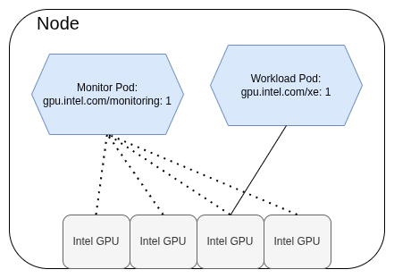

# Monitoring GPUs

## i915_monitoring resource

GPU plugin can be configured to register a monitoring resource for the nodes that have Intel GPUs on them. `gpu.intel.com/i915_monitoring` (or `gpu.intel.com/xe_monitoring`) is a singular resource on the nodes. A container requesting it, will get access to _all_ the Intel GPUs (`i915` or `xe` KMD device files) on the node. The idea behind this resource is to allow the container to _monitor_ the GPUs. A container requesting the `i915_monitoring` resource would typically export data to some metrics consumer. An example for such a consumer is [Prometheus](https://prometheus.io/).

<figure>
  
  <figcaption>Monitoring Pod listening to all GPUs while one Pod is using a GPU.</figcaption>
</figure>

For the monitoring applications, there are two possibilities: [Intel XPU Manager](https://github.com/intel/xpumanager/) and [collectd](https://github.com/collectd/collectd/tree/collectd-6.0). Intel XPU Manager is readily available as a container and with a deployment yaml. collectd has Intel GPU support in its 6.0 branch, but there are no public containers available for it.

To deploy XPU Manager to a cluster, one has to run the following kubectl:
```
$ kubectl apply -k https://github.com/intel/xpumanager/deployment/kubernetes/daemonset/base
```

This will deploy an XPU Manager daemonset to run on all the nodes having the `i915_monitoring` resource.

## Prometheus integration with XPU Manager

For deploying Prometheus to a cluster, see [this page](https://prometheus-operator.dev/docs/user-guides/getting-started/). One can also use Prometheus' [helm chart](https://github.com/prometheus-community/helm-charts).

Prometheus requires additional Kubernetes configuration so it can fetch GPU metrics. The following steps will add a Kubernetes Service and a ServiceMonitor components. The components instruct Prometheus how and where from to retrieve the metrics.

```
$ kubectl apply -f https://raw.githubusercontent.com/intel/xpumanager/master/deployment/kubernetes/monitoring/service-intel-xpum.yaml
$ kubectl apply -f https://raw.githubusercontent.com/intel/xpumanager/master/deployment/kubernetes/monitoring/servicemonitor-intel-xpum.yaml
```

With those components in place, one can query Intel GPU metrics from Prometheus with `xpum_` prefix.
